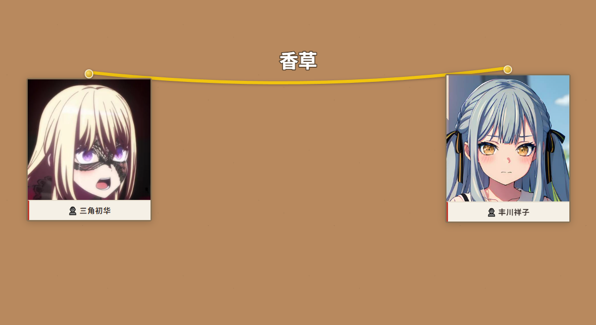

# 🎮 游戏档案

> 一个轻量的游戏剧情可视化推演工具，卡片式整理人物、物品、地点，用连线还原故事脉络。



---

## 功能

- **卡片管理** — 用方形卡片记录人物、物品、地点，支持图片上传/粘贴
- **自由连线** — 图钉拖拽连线，命名标注关系（"目击"、"持有"、"位于"……）
- **拖拽排版** — 卡片随意拖动，右下角拉伸尺寸，画布滚轮缩放
- **详情编辑** — 点击卡片打开详情弹窗，填写结构化的属性表格
- **存档系统** — 命名保存 / 读取 / 删除，JSON 格式存在本地

---

## 快速开始

### 一键启动（推荐）

双击 `start.bat`，自动安装依赖、启动服务、打开浏览器。

### 手动启动

```bash
# 进入项目目录
cd detective-board

# 安装依赖
pip install -r requirements.txt

# 启动服务
python main.py
```

浏览器打开 `http://127.0.0.1:8000`

---

## 操作指南

### 卡片

| 操作 | 方式 |
|---|---|
| 新建卡片 | 工具栏：👤 人物 / 📦 物品 / 📍 地点 |
| 编辑内容 | 点击卡片 → 弹出详情弹窗，填写属性表格 |
| 上传图片 | 详情弹窗中点击「📷 上传图片」或 Ctrl+V 粘贴 |
| 移动卡片 | 拖拽卡片中间区域或底部名签 |
| 拉伸卡片 | 拖拽卡片右下角把手 |
| 删除卡片 | 鼠标悬停卡片，点右上角 × |

### 连线

| 操作 | 方式 |
|---|---|
| 进入连线模式 | 点击卡片顶部的金色图钉，或工具栏「🔗 连线」 |
| 创建连线 | 连线模式下点击两张卡片，或从图钉拖到目标卡片 |
| 命名连线 | 单击连线或标签文字，输入名称和字号 |
| 删除连线 | 双击连线 |
| 退出连线模式 | 再次点击已选中的图钉，或按 Escape |

### 画布

| 操作 | 方式 |
|---|---|
| 平移 | 拖拽画布空白区域 |
| 缩放 | 滚轮（以鼠标位置为中心） |
| 清空 | 工具栏「🗑️ 清空」 |
| 保存 | 💾 保存 → 输入存档名 |
| 读取 | 📂 读取 → 选择存档 |

---

## 项目结构

```
detective-board/
├── main.py              # FastAPI 后端
├── requirements.txt     # 依赖
├── README.md            # 本文件
├── 预览.png             # 截图
├── static/
│   └── index.html       # 完整前端（单页应用）
└── data/                # JSON 存档目录
```

## 技术栈

- **后端**: Python / FastAPI
- **前端**: 纯 HTML + CSS + JavaScript（零框架）
- **存储**: JSON 文件
- **连线**: SVG 贝塞尔曲线
- **图片**: base64 内嵌（粘贴上传均支持）
