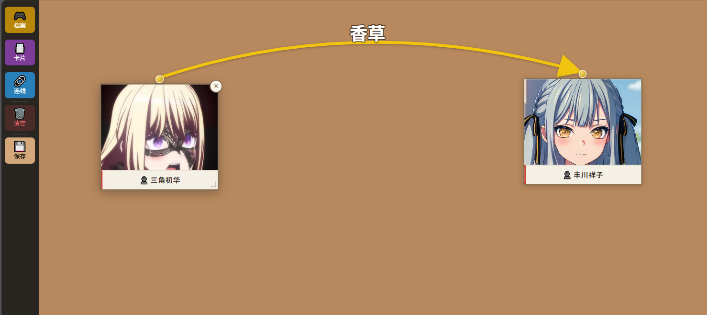

# 🎮 线索墙 · Clue Wall

> 轻量级剧情推理可视化工具——卡片化整理人物·物品·地点，用连线还原故事脉络。



---

## 功能

- **🎮 存档系统** — 侧边栏「档案」一键切换推演墙，自动保存当前进度，支持新建/重命名/删除
- **📇 卡片管理** — 方形卡片记录人物/物品/地点，支持图片上传、剪贴板粘贴、属性编辑
- **🔗 智能连线** — 点击图钉或「连线」按钮，支持箭头样式（无箭头/单箭头/双箭头）
- **✂️ 切断模式** — 剪刀模式下点击连线直接删除
- **✏️ 连线编辑** — 单击连线浮窗修改名称、字号、箭头样式、颜色
- **🔄 拖拽曲线** — 连线可拖拽调整曲度，标签自动跟随贝塞尔曲线中点
- **🎨 画布操作** — 拖拽平移、滚轮缩放
- **🖥️ 桌面版** — 标准窗口 + Ctrl+Shift+D 全局热键唤出

---

## 快速开始

### Web 版

```bash
pip install -r requirements.txt
python main.py
```

浏览器打开 `http://localhost:8000` 即可使用。

### 桌面版

```bash
pip install -r requirements.txt
python desktop_app.py
```

支持全局热键 **Ctrl+Shift+D** 显示/隐藏窗口。

### 打包 EXE

推荐在干净的虚拟环境中打包，避免捆绑 Anaconda 等大体积依赖：

```bash
python -m venv .buildenv
.buildenv\Scripts\pip install fastapi uvicorn pywebview pyinstaller
.buildenv\Scripts\pyinstaller --onefile --windowed --name "线索墙" ^
    --add-data "static;static" ^
    --collect-all "fastapi" --collect-all "uvicorn" ^
    --collect-all "starlette" --collect-all "pydantic" ^
    --hidden-import "uvicorn.loggers" --hidden-import "uvicorn.loops.auto" ^
    --hidden-import "uvicorn.protocols.http.auto" ^
    --hidden-import "uvicorn.protocols.websocket.auto" ^
    --hidden-import "uvicorn.middleware.asgi2" --hidden-import "uvicorn.middleware.wsgi" ^
    --exclude "PyQt5" --exclude "PySide6" --exclude "PySide2" --exclude "PyQt6" ^
    --exclude "matplotlib" --exclude "notebook" --exclude "ipython" ^
    --exclude "scipy" --exclude "pandas" --exclude "tkinter" --exclude "PIL" ^
    --strip ^
    desktop_app.py
```

打包后 EXE 约 15~20MB，存档保存在 `%APPDATA%/线索墙/`。

---

## 操作指南

### 侧边栏

| 按钮 | 功能 |
|---|---|
| 🎮 档案 | 点击打开存档列表，切换/新建/重命名/删除推演墙 |
| 📇 卡片 | 点击弹出类型选择（人物·物品·地点） |
| 🔗 连线 | 点击进入连线模式，选箭头样式后依次点两张卡片 |
| ✂️ 切断 | 在连线浮窗中选择「切断」进入剪刀模式 |
| 🗑️ 清空 | 清空当前画板 |
| 💾 保存 | 保存当前推演墙 |

### 卡片操作

| 操作 | 方式 |
|---|---|
| 新建卡片 | 侧边栏「📇 卡片」→ 选类型 |
| 编辑内容 | 单击卡片打开详情弹窗 |
| 上传图片 | 编辑弹窗中「📷 上传图片」或「📋 粘贴」 |
| 移动卡片 | 拖拽卡片 |
| 删除卡片 | 编辑弹窗中点击删除 |

### 连线操作

| 操作 | 方式 |
|---|---|
| 进入连线模式 | 点击卡片顶部图钉，或侧边栏「🔗 连线」→ 选箭头样式 |
| 创建连线 | 连线模式下依次点击两张卡片 |
| 调整曲度 | 拖拽连线上的路径 |
| 编辑连线 | 单击连线弹出浮窗 → 改名称/字号/箭头/颜色 |
| 删除连线 | 编辑浮窗中点击 🗑️，或进入「切断」模式后点击连线 |

### 画布

| 操作 | 方式 |
|---|---|
| 平移画布 | 拖拽空白区域 |
| 缩放 | 滚轮 |
| 右键菜单 | 空白处右键可快速创建卡片、保存 |

---

## 技术栈

- **后端**: Python 3 + FastAPI
- **前端**: 纯 HTML/CSS/JS（无框架） / 桌面版: pywebview (Edge WebView2)
- **图形**: SVG（贝塞尔曲线连线）
- **存储**: JSON 文件

## 项目结构

```
clue-wall/
├── main.py              # FastAPI 后端
├── desktop_app.py       # 桌面版入口（pywebview）
├── static/index.html    # 前端页面（单页应用）
├── data/                # Web 模式存档目录
├── requirements.txt     # 依赖
├── start.bat            # 一键启动桌面版
├── build.bat            # EXE 打包脚本
└── README.md
```


